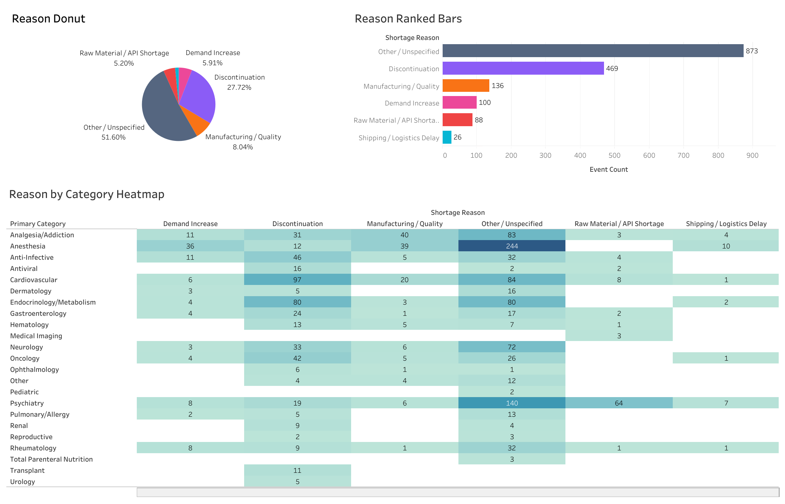

# FDA Drug Shortage Supply Chain Risk Dashboard

## Overview

This project provides a healthcare supply chain risk dashboard leveraging public FDA openFDA data. By computing composite risk scores and detecting anomalies, it brings transparency to opaque supply chains, manufacturer consolidation, and geopolitical risks.

[Link to Dashboard on Tableau Public](https://public.tableau.com/app/profile/alexander.peralta/viz/fda-supply-chain-risk-dashboard/RiskLeaderboard?publish=yes)

## Key Findings

The engine evaluates 1,692 shortage records across 248 unique drugs to generate a composite risk score (0–100). The scoring relies on four weighted signals:

$$Risk = 0.30(\text{Recurrence}) + 0.25(\text{Duration}) + 0.25(\text{Cause}) + 0.20(\text{Status})$$

To identify heavily disrupted therapeutic categories, the pipeline flags outliers using a standard Z-score analysis:

$$z = \frac{x - \mu}{\sigma}$$

- Anesthesia ($z = 2.25$): 341 shortage records driven by injectable supply chain fragility.
- Psychiatry ($z = 1.73$): 288 records reflecting systemic stimulant medication shortages.
- Pediatrics ($z = 1.69$): 284 records showing cross-cutting formulation vulnerabilities.

Highest-Risk Drug: Lidocaine Hydrochloride Injection (Score: 85.7), currently suffering from 70 distinct shortage events and an active unavailability spanning an average duration of over 12 years.

## Dashboard Example


## Quick Start
You can run the complete ETL, risk scoring, and anomaly detection pipeline using Python 3.10+.

```bash
# Clone the repository and install dependencies
git clone https://github.com/alexanderhperalta/fda-supply-chain-risk.git
cd fda-supply-chain-risk
pip install -r requirements.txt

# Execute the pipeline and export data
python main.py
python -m src.export_tableau
```

Once exported, open dashboard/fda-supply-chain-risk-dashboard.twbx in Tableau to explore the interactive leaderboards, cause breakdowns, and time-series trends.